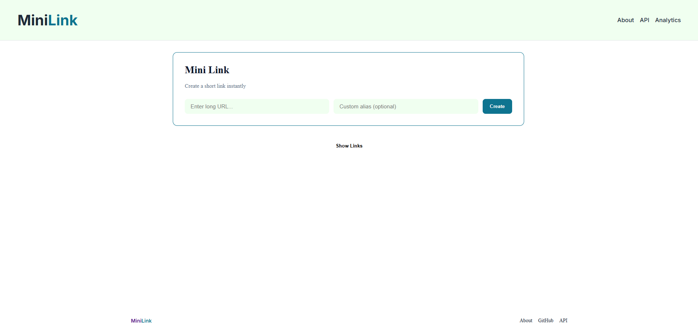
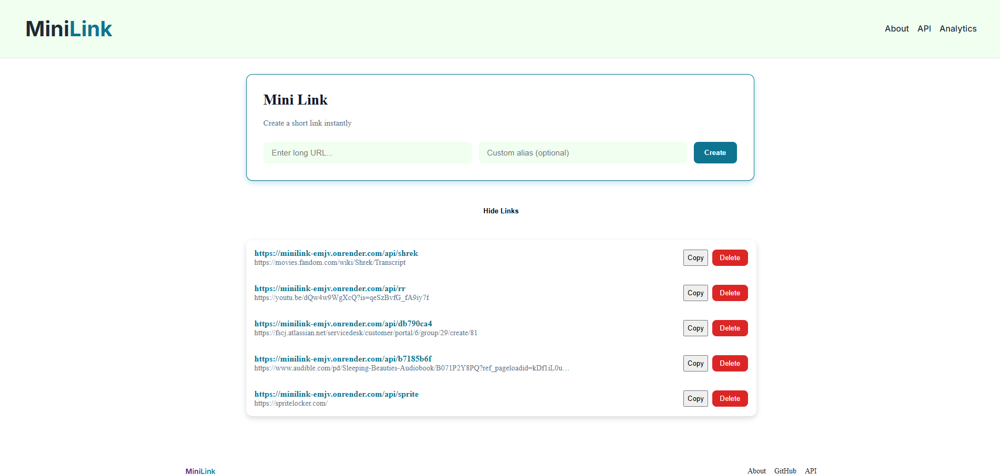
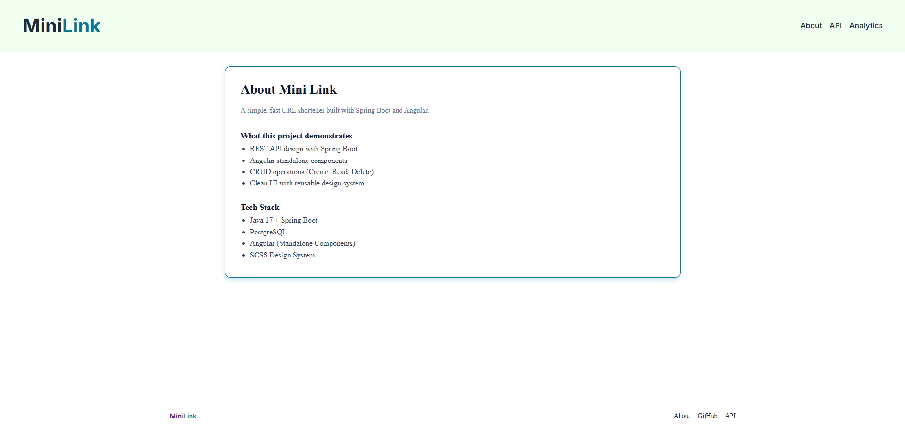
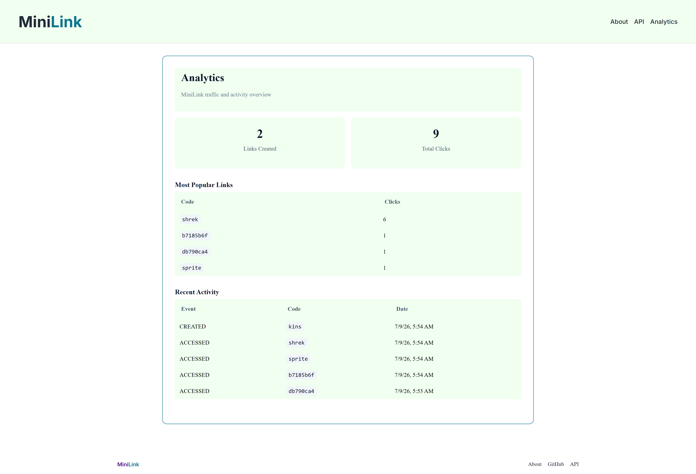

# MiniLink

MiniLink is a lightweight URL shortening service built with Java, Spring Boot, PostgreSQL, and Angular. It provides a REST API for creating shortened URLs, a modern web interface for managing links, and an analytics dashboard for monitoring link creation and redirect activity.
The application uses PostgreSQL for persistence and Flyway for database version control.

## Live Demo

The application is deployed and publicly available. Because this is hosted with Render's free tier, spool-up time can be up to 50 seconds. <br><em><u>Please be patient.</u></em>

**Frontend:**</br> 
https://minilink-static.onrender.com/

**Backend API:** </br>
https://minilink-emjv.onrender.com/

**Swagger/OpenAPI:**

https://minilink-emjv.onrender.com/swagger-ui/index.html

## Features

**Backend**
- Create shortened URLs from long web addresses
- Generate unique short codes automatically
- Create custom aliases for memorable links (e.g. `/google`)
- Automatically redirect users from short links to their original destinations
- Validate submitted URLs before saving
- Persist data using PostgreSQL and Spring Data JPA
- Version database changes using Flyway migrations
- Explore and test endpoints through Swagger/OpenAPI documentation
- Optional custom aliases instead of generated code
- Track link creation events
- Record redirect events for analytics
- Expose analytics data through REST endpoints

**Frontend**
- Create MiniLinks from a simple UI form
- View all created links in a dynamic list
- One-click actions per link:
  - Open link (direct redirect)
  - Copy short URL to clipboard
  - Delete link
- Real-time list updates after creation/deletion
- Analytics dashboard displaying link statistics
- View total links created
- View redirect/click metrics
- Responsive interface for desktop and mobile

---

## Screenshots
<br>
<br>
<figure>
  <kbd>
    
  </kbd>
  <br>
  <figurecaption><em>Home Page</em></figurecaption>
</figure>
<br><br><br>
<figure>
  <kbd>
    
  </kbd>
  <br>
  <figurecaption><em>Created Links Shown on Home Page</em></figurecaption>
</figure>
<br><br><br>
<figure>
  <kbd>
    
  </kbd>
<figurecaption><em>About Page</em></figurecaption>
</figure>
<br><br><br>
<figure>
  <kbd>
    
  </kbd>
<figurecaption><em>Analytics Page</em></figurecaption>
</figure>
<br><br><br>

---

## Tech Stack

**Backend**
- Java 17
- Spring Boot
- Spring Web
- Spring Data JPA
- PostgreSQL
- Flyway
- Maven
- Swagger / OpenAPI
- Lombok

***Frontend**
- HTML
- SCSS
- Angular
- Typescript
- Fetch API for backend communication

## Analytics

MiniLink includes an analytics dashboard that provides insight into application usage.

**Current analytics include:**

- Total MiniLinks created
- Link creation events
- Redirect activity
- Overall application statistics

The analytics page consumes backend REST endpoints to display live application data.

## API Endpoints

### Create a Short Link

**POST** `/api`

Request:

```json
{
    "originalUrl": "https://www.google.com"
}
```

Response:

```json
{
    "miniCode": "26981388",
    "originalUrl": "https://www.google.com"
}
```

---

### Redirect to Original URL

**GET** `/{miniCode}`

Example:

```text
http://localhost:8080/api/26981388
```

The application responds with an HTTP redirect to the original URL.

### List All Links
**Get** `/api`

Response:

```json
{
  {
    "miniCode": "26981388",
    "originalUrl": "https://www.google.com"
  },
  {
    "miniCode": "rick-roll",
    "originalUrl": "https://www.youtube.com/watch?v=dQw4w9WgXcQ"
  }
}
```

---

## Frontend Overview

The frontend provides a simple dashboard for managing MiniLinks.

## Main Features

## Create Link Forms

Users can paste long URL and generate MiniLink instantly.


## Link List
Each created link appears in a list with the following actions:
- Open – navigates directly to the original URL via backend redirect
- Copy – copies the short URL to clipboard
- Delete – removes the MiniLink from the system

The list updates automatically after any action.

---

## Database Migrations

This project uses Flyway to manage database schema changes.

Migration scripts are located in:

```text
src/main/resources/db/migration
```

Flyway automatically applies any pending migrations when the application starts.

---

## Deployment

The frontend and backend are deployed separately.

- Spring Boot backend deployed to Render
- Angular frontend deployed to Render
- PostgreSQL database hosted by Render

Environment variables are used to securely configure database credentials and application settings.

---


## Running Backend Locally

### Prerequisites

- Java 17+
- Maven 3.9+
- PostgreSQL

### 1. Create the Database

Connect to PostgreSQL:

```bash
psql -U postgres
```

Create the database:

```sql
CREATE DATABASE minilink;
```

Exit psql:

```sql
\q
```

---

### 2. Configure Local Properties

Using IntelliJ, add your local username and password to the `Environment Variables`

```properties
spring.datasource.url=jdbc:postgresql://localhost:5432/minilink
spring.datasource.username=${DB_USERNAME}
spring.datasource.password=${DB_PASSWORD}

spring.jpa.hibernate.ddl-auto=validate
spring.flyway.enabled=true
```

---

### 3. Run the Application

Using Maven:

```bash
mvn spring-boot:run
```

Or run `MiniLinkApplication` directly from your IDE.

---

### 4. Access Swagger Documentation

Open:

```text
http://localhost:8080/swagger-ui/index.html
```

The OpenAPI specification is available at:

```text
http://localhost:8080/v3/api-docs
```

---

## Running Frontend Locally

The frontend is built with Angular and runs using the Angular CLI (ng serve), serving the application on http://localhost:4200.

### Navigate to frontend

```bash
cd MiniLink/mini-link-web
```

### Install dependencies

```bash
npm install
```

This will install all required packages listed in package.json

### Start angular dev server

```bash
ng serve
```

### Access the frontend

```bash
http://localhost:4200
```

Angular’s default dev server runs on 4200, not 3000.

---

## Project Structure

```text
MiniLink
├──mini-link-web
│   └──src
│       ├── app
│       │   ├── layouts
│       │   ├── models
│       │   ├── pages 
│       │   │   ├── about
│       │   │   ├── analytics
│       │   │   ├── api
│       │   │   └── home
│       │   └── shared
│       │       ├── components
│       │       |       ├── footer
│       │       |       └── header
│       │       └── resources
│       └── environments
├──src
    ├── main
    │   ├── java
    │   │   └── locke/dustin/minilink
    │   │       ├── config
    │   │       ├── controller
    │   │       ├── dto
    │   │       ├── entity
    │   │       ├── repository
    │   │       ├── service
    │   │       ├── type
    │   │       └── util
    │   │            └── exception
    │   └── resources
    │       └── db
    │           └── migration
    └── test
```

---

## Future Enhancements

- Base62 short code generation
- Link expiration dates
- Unit and integration tests
- Docker support
- Authentication (user-specific links)
- Password-protected links
- Drag-and-drop link organization

---

## License

This project is available under the MIT License.

## Author
Dustin Locke
